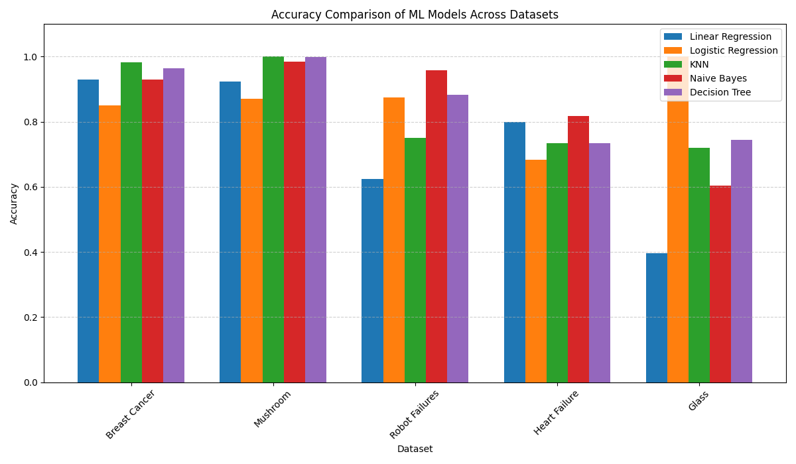

# INSTRICTION TO EXECUTE THE ALGORITHMS 

# Data Preprocessing Steps:

# Load dataset
    df = pd.read_csv(file_path)

# Special case: robot dataset with time series data
    if "robot" in file_path.lower():
        df = extract_robot_features(df, target_column)
    

# Move target column to the end
    target = df.pop(target_column)
    df[target_column] = target

# Label encode categorical features
    for col in df.columns:
        if df[col].dtype == 'object' or df[col].dtype.name == 'category':
            df[col], _ = pd.factorize(df[col])

# Separate features and target
    X = df.iloc[:, :-1].values
    y = df.iloc[:, -1].values.astype(float)

# Min-max normalization
    X_min = X.min(axis=0)
    X_max = X.max(axis=0)
    X = (X - X_min) / (X_max - X_min + 1e-8)

# Add bias column
    if add_bias:
        bias = np.ones((X.shape[0], 1))
        X = np.hstack((bias, X))

# Shuffle and split (80-20)
    indices = np.arange(X.shape[0])
    np.random.shuffle(indices)
    X, y = X[indices], y[indices]

    split_idx = int(0.8 * len(X))
    return X[:split_idx], X[split_idx:], y[:split_idx], y[split_idx:]

# Extract features from robot dataset
    def extract_robot_features(df, target_column):
    signal_types = ['Fx', 'Fy', 'Fz', 'Tx', 'Ty', 'Tz']
    features = {}

    for sig in signal_types:
        sig_cols = [col for col in df.columns if col.startswith(sig)]
        values = df[sig_cols].values
        features[f'{sig}_mean'] = values.mean(axis=1)
        features[f'{sig}_var'] = values.var(axis=1)

    features_df = pd.DataFrame(features)
    features_df[target_column] = df[target_column].values
    return features_df

# Linear Regression

    Train and test the model with different datasets.

    # for Glass dataset
        file_path = "datasets/glass_details_dataset.csv"
        target_col = "Class"

    # for Heart Failure dataset
        file_path = "datasets/heart_failure_clinical_records_dataset.csv"
        target_col = "DEATH_EVENT"

    # for Robot Execution Failures dataset
        file_path = "datasets/robot_dataset.csv"
        target_col = "Class"

    # for Wisconsin Diagnostic Breast Cancer dataset
        file_path = "datasets/wisconsin_diagnostic_breast_cancer_dataset.csv"
        target_col = "Diagnosis"

    # for Mushroom dataset
        file_path = "datasets/mushroom_dataset.csv"
        target_col = "class"

# Logistics Regression

    Train and test the model with different datasets.

    # for Glass dataset
        file_path = "datasets/glass_details_dataset.csv"
        target_col = "Class"

    # for Heart Failure dataset
        file_path = "datasets/heart_failure_clinical_records_dataset.csv"
        target_col = "DEATH_EVENT"

    # for Robot Execution Failures dataset
        file_path = "datasets/robot_dataset.csv"
        target_col = "Class"

    # for Wisconsin Diagnostic Breast Cancer dataset
        file_path = "datasets/wisconsin_diagnostic_breast_cancer_dataset.csv"
        target_col = "Diagnosis"

    # for Mushroom dataset
        file_path = "datasets/mushroom_dataset.csv"
        target_col = "class"

# KNN 

    Train and test the model with different datasets. Can modify the k value to check the accuracy.

    #for Mushroom dataset
        load_and_run_knn("datasets/mushroom_dataset.csv", "class", k=7)

    #for Robot Execution Failures dataset
        load_and_run_knn("datasets/robot_dataset.csv", "Class", k=3)

    #for Wisconsin Diagnostic Breast Cancer dataset
        load_and_run_knn("datasets/wisconsin_diagnostic_breast_cancer_dataset.csv", "Diagnosis", k=6)

    #for Heart Failure dataset
        load_and_run_knn("datasets/heart_failure_clinical_records_dataset.csv", "DEATH_EVENT", k=9)

    #for Glass dataset
        load_and_run_knn("datasets/glass_details_dataset.csv", "Class", k=7)

# Naive Bayes

    Train and test the model with different datasets.

    #for Heart Failure dataset
        load_and_run_naive_bayes("datasets/heart_failure_clinical_records_dataset.csv", "DEATH_EVENT")

    #for Robot Execution Failures dataset
        load_and_run_naive_bayes("datasets/robot_dataset.csv","Class")

    #for Wisconsin Diagnostic Breast Cancer dataset
        load_and_run_naive_bayes("datasets/wisconsin_diagnostic_breast_cancer_dataset.csv","Diagnosis")

    #for Mushroom dataset
        load_and_run_naive_bayes("datasets/mushroom_dataset.csv","class")

    #for Glass dataset
        load_and_run_naive_bayes("datasets/glass_details_dataset.csv","Class")

# Decision Tree

   Train and test the model with different datasets.

    #for Heart Failure dataset
        load_and_run_naive_bayes("datasets/heart_failure_clinical_records_dataset.csv", "DEATH_EVENT")

    #for Robot Execution Failures dataset
        load_and_run_naive_bayes("datasets/robot_dataset.csv","Class")

    #for Wisconsin Diagnostic Breast Cancer dataset
        load_and_run_naive_bayes("datasets/wisconsin_diagnostic_breast_cancer_dataset.csv","Diagnosis")

    #for Mushroom dataset
        load_and_run_naive_bayes("datasets/mushroom_dataset.csv","class")

    #for Glass dataset
        load_and_run_naive_bayes("datasets/glass_details_dataset.csv","Class")

# Overall Accuracy Comparison for all the datasets over the algorithms

The grouped bar chart shows how each machine learning model performed across five datasets. KNN, Decision Tree, and Naive Bayes generally achieved high accuracy, especially on well-structured datasets like Mushroom and Breast Cancer. In contrast, Linear and Logistic Regression showed lower performance on multiclass datasets like Glass and Robot Failures, highlighting the importance of choosing the right model based on data type and complexity.
